# Learn Reinforcement Learning

Repository to learn RL.
- python 3.11.4
- pytorch 2.0.1 + cu117
- gymnasium
- RL algorithms

Before running the codes, make sure that running ```pip install -r requirements.txt``` first. 

## [dqn_tutorial](./dqn_tutorial.ipynb)

Jupyter notebook to deal with simple DQN algorithm. 
Deep Q Network (DQN) is a reinforcement learning algorithm that is model-free, value-based and off-policy. 

It is kind of TD and its time difference is calculated as below. 

$$ \delta = Q(s_t, a_t) - (r_t + \gamma * max_a Q_{target}(s_{t+1}, a)) $$

This notebook trained simple DQN network for two tasks - Acrobot-v1 and CartPole-v1. 

|Acrobot-v1|CartPole-v1|
|-|-|
|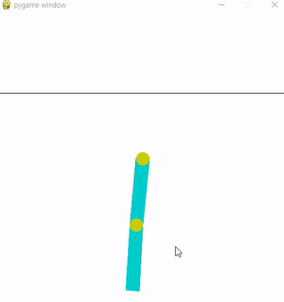|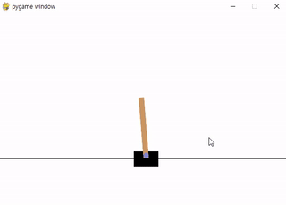|
|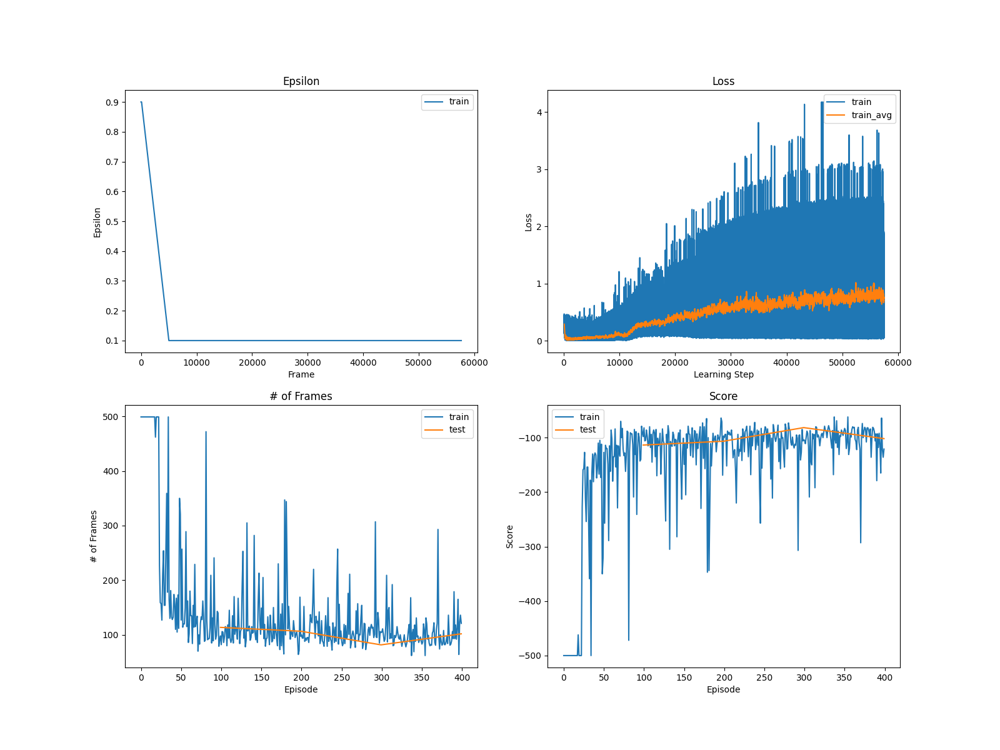|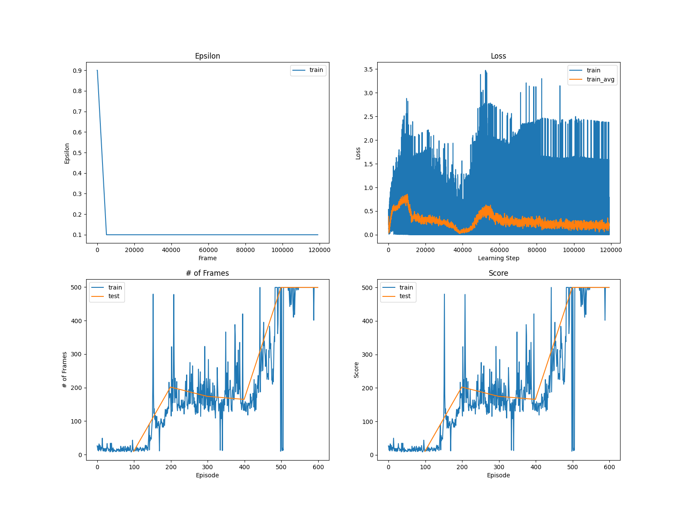|

## [dqn](./dqn.ipynb)

Jupyter notebook to deal with various dqn-based algorithms. 
In this notebook, the agent is trained on various tasks - Pong-v5, Breakout-v5, Enduro-v5, and DemonAttack-v5. 

### Pong
Example:

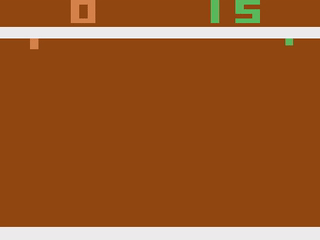

For rainbow algorithm, training status is shown in plot below. 
- **Noise**: Rainbow algorithm includes noisy networks, which perturbes weight and bias of networks. We can see that noise decreases as the agent learns Pong. 
- **Loss**: Loss between model prediction and transition samples. 
- **Frames per episode**: Increases in early training stage as the agent starts to get points, and decreases in the end as the opponent rarely get points. 
- **Score**: Converges around 20.0

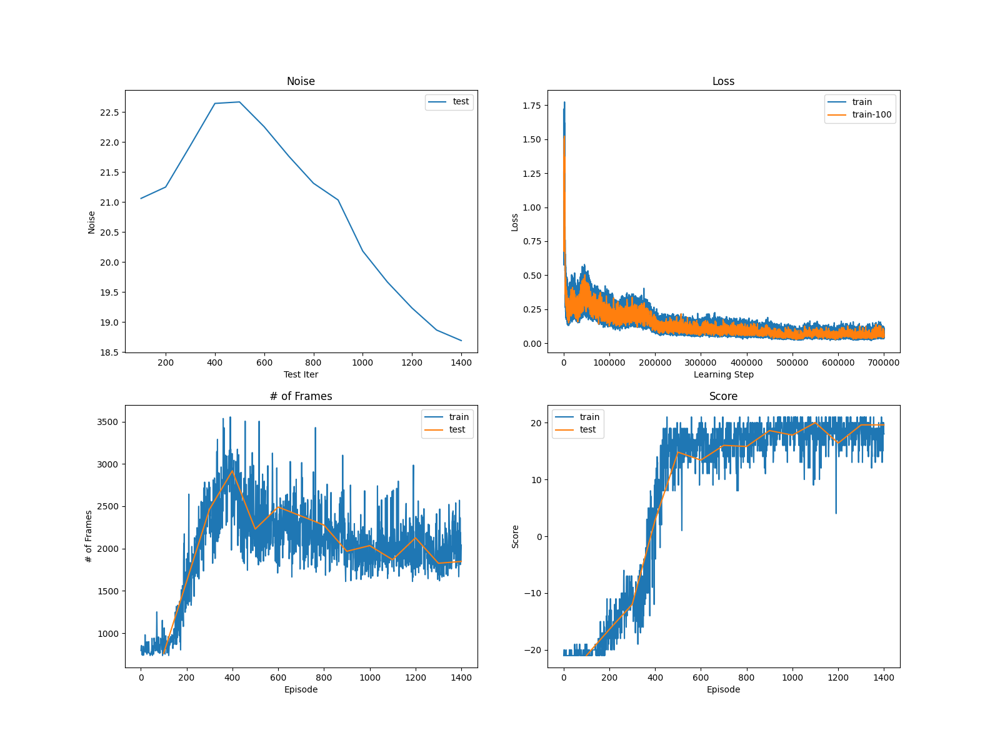

Plot below shows test scores for various DQN-based algorithms. All of them shows satisfying scores because Pong is easy environment, but Dueling and Rainbow shows the best performance. 

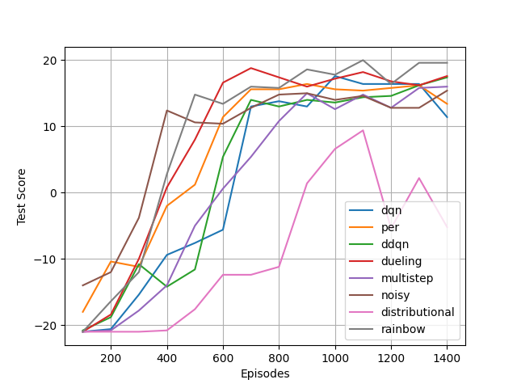

### Enduro
Example:

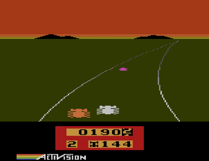

For Dueling DQN, training status is shown in the plot below. 
- **Epsilon**: The agent followed random policy probability of 0.9 in the leary stage, then turns to greedy policy. The final random policy probability is 0.1. 
- **Loss**: Loss between model prediction and transition samples. 
- **Frames per episode**: In enduro, longer game means higher score. So number of frames increases during the training. 
- **Score**: Increases rapidly, and seems to converge to 900 ~ 1000. SOTA algorithm shows 2300, but my model did around 40% of optimal algorithm. 

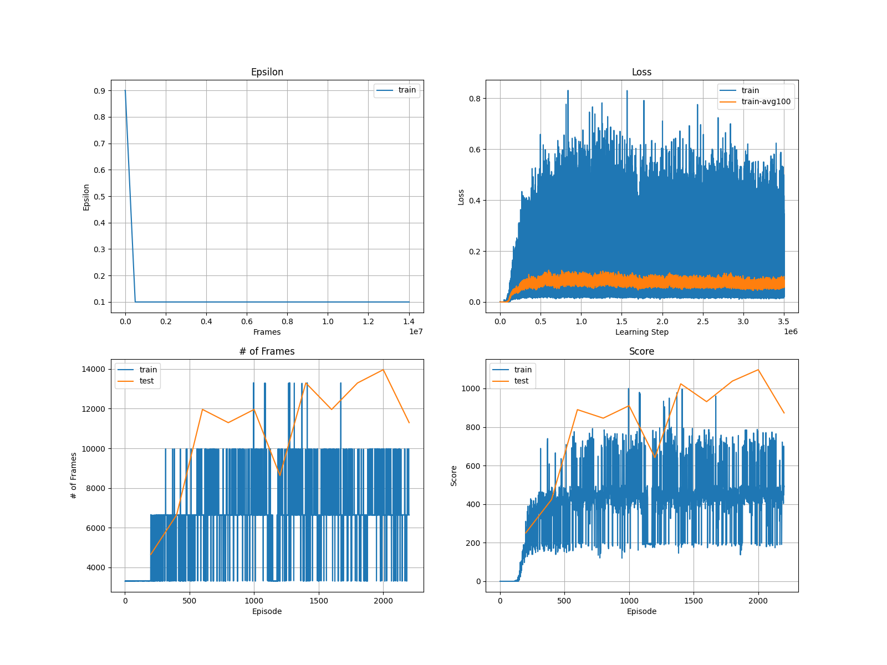

Plot below shows test scores for various DQN-based algorithms. All of them shows final scores around 800 ~ 100. I think Dueling DQN was the best performer. However, it didn't play enduro well as SOTA algorithm. The reason can be (1) implementation fault (2) bad hyperparameter (3) not enough training. 

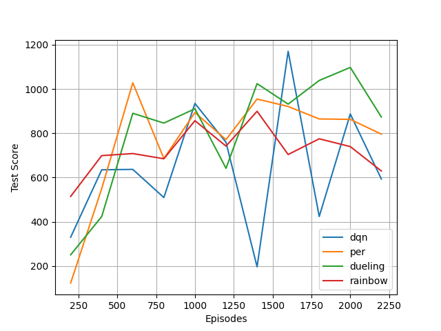

### Breakout
(Todo)

### DemonAttack
(Todo)

## [reinforce_tutorial](./reinforce_tutorial.ipynb)

Jupyter notebook to deal with simple REINFORCE algorithm. 
REINFORCE is a policy-based reinforcement learning algorithm that is model-free and on-policy. 

It is kind of Monte-Carlo and model is updated after each episode ends. 

$$ \theta \leftarrow \theta + \alpha \sum_{t=0}^T G_t \nabla_\theta \ln \pi(A_t|S_t;\pi_\theta) $$

This notebook trained simple policy network for CartPole-V1 

|CartPole-v1|
|-|
|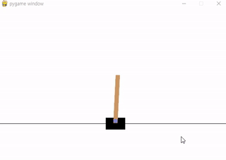|
|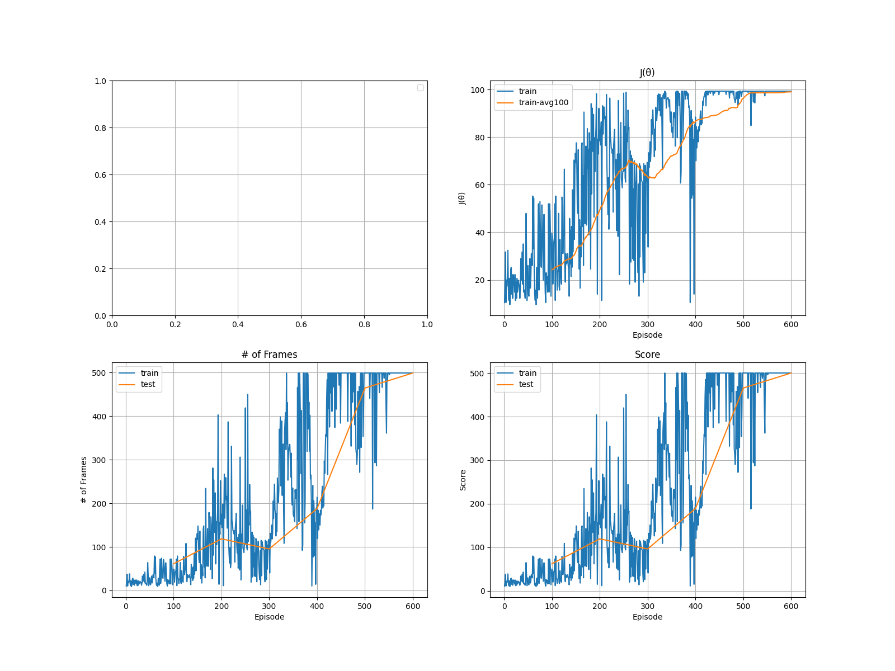|

## [reinforce](./reinforce.ipynb)

Notebook with various REINFORCE-based algorithms such as REINFORCE, Actor-Critic, A2C, and A3C. 
The agent is trained on two tasks - LunarLander-v2 (discrete action), and BipedalWalker-v3 (continuous action)

### LunarLander
Example:

(TODO)

training status of REINFORCE is shown in the plot below. 
- **J($\theta$)**: Object function for policy gradient. Increases as training because expected reward increases. 
- **Loss**: Actor loss and critic loss. REINFORCE has actor loss only. 
- **Frames per episode**: In LunarLander, frames increases as the rocket avoids crashing, but decreases as it can land in shorter time. 
- **Score**: Increases as training, and converges to 100 ~ 200. Scores above 200 are considered as succeess, so my REINFORCE couldn't truly success. 

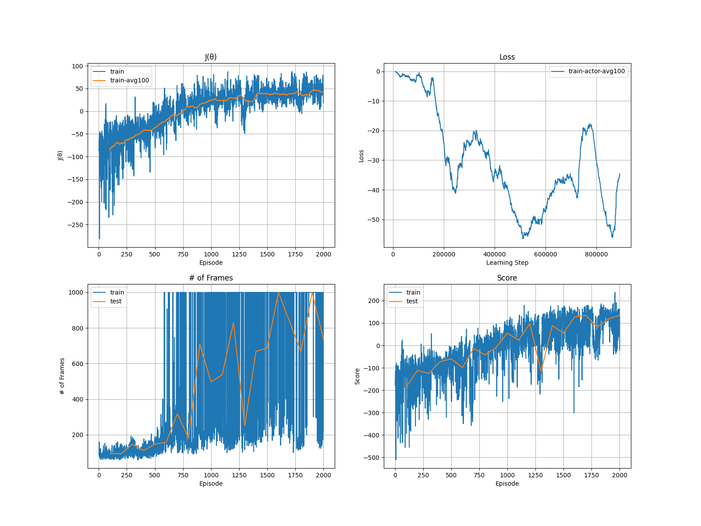

Plot below shows test scores for various REINFORCE-based algorithms. 

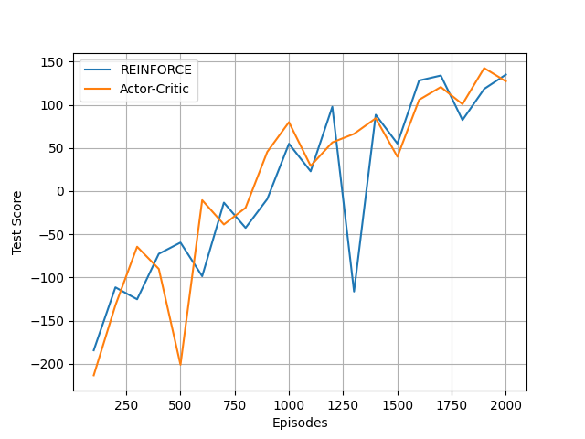

### BipedalWalker
(TODO)

## Todo

### Value based
- [x] DQN
- [x] PER (Prioritized Experience Replay)
- [x] Double DQN
- [x] Dueling DQN
- [x] Multi-step learning
- [x] Distributional RL (QR-DQN)
- [x] Noisy Networks
- [x] Rainbow

### Policy based
- [x] REINFORCE
- [x] Actor Critic
- [ ] A2C (Advantage Actor Critic)
- [ ] A3C (Asynchronous Advantage Actor Critic)
- [ ] DDPG (Deep Deterministic Policy Gradient)
- [ ] PPO (Proximal Policy Optimization)
- [ ] SAC (Soft Actor Critic)
